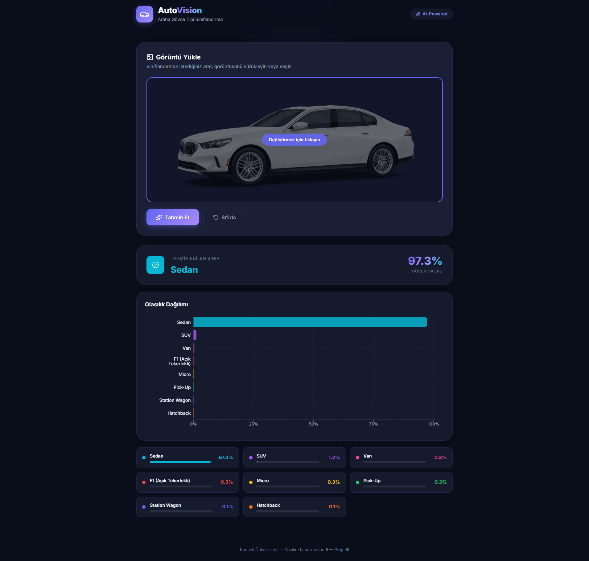
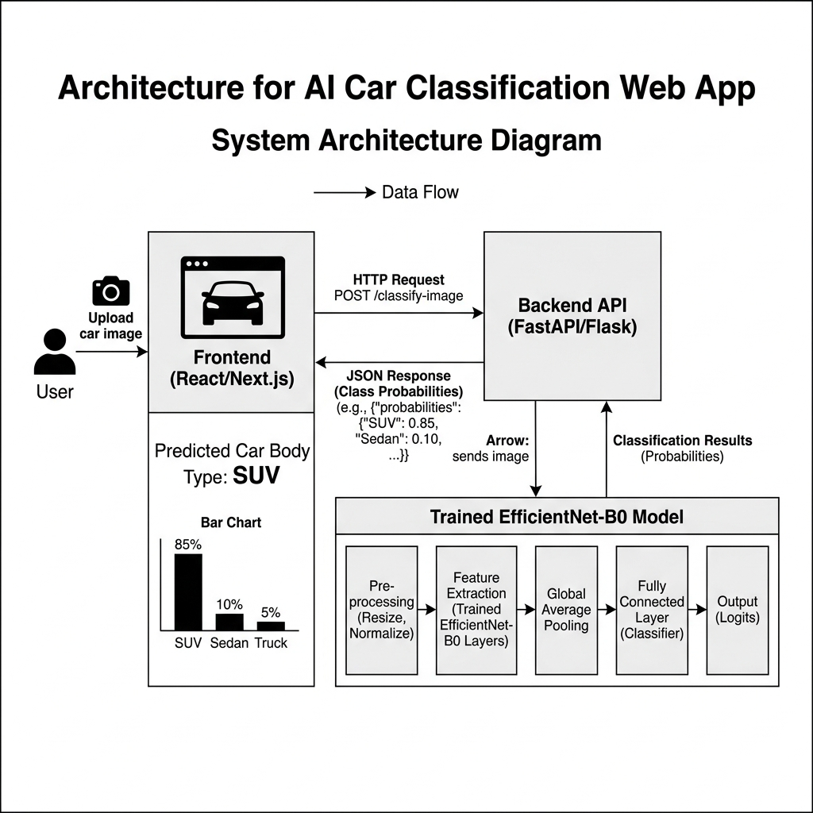
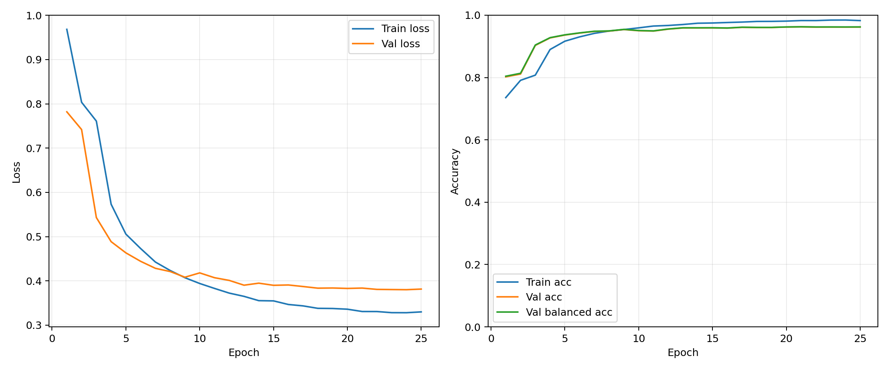
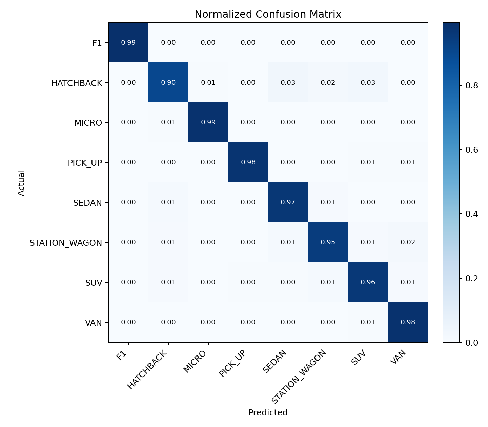

# AutoVision

AutoVision is a deep learning project for classifying car body types from images. The project covers the full pipeline: dataset preprocessing, EfficientNet-B0 training, error analysis, and deployment with a React frontend and FastAPI backend.

- Classes: `F1`, `HATCHBACK`, `MICRO`, `PICK_UP`, `SEDAN`, `STATION_WAGON`, `SUV`, `VAN`
- Model: ImageNet-pretrained `EfficientNet-B0`
- Test accuracy: `96.47%`
- Balanced accuracy: `96.50%`
- Macro F1-score: `96.48%`
- Included model checkpoint: `notebooks/outputs/efficientnet_b0_highres_320_v1/best_efficientnet_b0.pt`
- Dataset: [46K Car Body Type Image Dataset (8 Classes)](https://www.kaggle.com/datasets/denizedenize/46k-car-body-type-image-dataset-8-classes)
- Detailed report: [210201142.pdf](./210201142.pdf)

## Project Overview

The goal of this project is to automatically predict the body type of a vehicle from a single image. The final system includes:

- an offline preprocessing pipeline for preparing a clean fixed-resolution dataset
- a transfer-learning training pipeline based on EfficientNet-B0
- evaluation and error-analysis scripts
- a web interface for uploading an image and viewing class probabilities

## Method

### 1. Preprocessing

The dataset preparation step standardizes raw images before training:

- exact duplicate removal
- EXIF orientation correction
- RGBA to RGB conversion
- aspect-ratio-preserving resize
- white-background letterboxing
- conversion to `320 x 320`
- fixed train/validation/test split
- ImageNet normalization during training and inference

### 2. Training

The final model was trained with `EfficientNet-B0` using transfer learning:

- pretrained ImageNet weights
- classifier warm-up with frozen backbone for `2` epochs
- full fine-tuning for up to `25` epochs
- batch size `16`
- dropout `0.3`
- weighted sampler
- class-weighted loss
- label smoothing
- moderate augmentation profile
- evaluation-time `hflip` TTA

### 3. Deployment

The trained model is integrated into a simple web application:

- `frontend/`: React + Vite user interface
- `backend/`: FastAPI inference API
- uploaded images are preprocessed with the same letterbox + normalization logic
- prediction output is returned as class probabilities

## Visuals

### Frontend



### System Architecture



### Training Curves



### Normalized Confusion Matrix



## Repository Structure

```text
backend/        FastAPI inference service
frontend/       React frontend
notebooks/      training, preprocessing, and analysis scripts
docs/images/    README visuals
210201142.pdf   project report
```

The repository also includes the final trained EfficientNet-B0 checkpoint and its main evaluation metadata:

- `notebooks/outputs/efficientnet_b0_highres_320_v1/best_efficientnet_b0.pt`
- `notebooks/outputs/efficientnet_b0_highres_320_v1/run_config.json`
- `notebooks/outputs/efficientnet_b0_highres_320_v1/test_metrics.json`
- `notebooks/outputs/efficientnet_b0_highres_320_v1/test_classification_report.txt`

## How To Run

### 1. Install backend dependencies

```bash
pip install -r requirements.txt
```

For training utilities:

```bash
pip install -r requirements-train.txt
```

### 2. Build the frontend

```bash
cd frontend
npm install
npm run build
cd ..
```

### 3. Make sure a trained checkpoint exists

By default, the backend expects the checkpoint at:

```text
notebooks/outputs/efficientnet_b0_highres_320_v1/best_efficientnet_b0.pt
```

This checkpoint is included in the repository, so the project can be run without retraining.

You can also point to a different checkpoint with:

```bash
set AUTOVISION_MODEL_PATH=C:\path\to\best_efficientnet_b0.pt
```

### 4. Start the backend

```bash
cd backend
python main.py
```

Then open:

```text
http://localhost:7860
```

## Training Commands

These are the commands used in the final EfficientNet-B0 workflow.

### Freeze high-resolution dataset

```bash
python notebooks\freeze_dataset.py --clear --raw-root data\new_synthetic_car_dataset_all_data --output-root data\processed_convnext_tiny_320 --background white --image-size 320 --dedupe-exact --max-per-class 0 --max-f1 0
```

### Train EfficientNet-B0

```bash
python notebooks\train_small_highres.py --data-root data/processed_convnext_tiny_320 --output-dir notebooks/outputs/efficientnet_b0_highres_320_v1 --model-name efficientnet_b0 --image-size 320 --epochs 25 --freeze-epochs 2 --batch-size 16 --device cuda --num-workers 0 --patience 8 --aug-profile moderate --eval-tta hflip
```

### Analyze errors

```bash
python notebooks\analyze_small_highres_errors.py --data-root data/processed_convnext_tiny_320 --checkpoint notebooks/outputs/efficientnet_b0_highres_320_v1/best_efficientnet_b0.pt --output-dir notebooks/outputs/error_analysis/efficientnet_b0_highres_320_v1 --split test --batch-size 16 --device cuda --num-workers 0 --tta hflip
```

## Notes

- Large datasets, generated training outputs, and checkpoint files are intentionally not tracked in Git.
- The report contains the detailed explanation of preprocessing, model architecture, metrics, and system design: [210201142.pdf](./210201142.pdf)
- The Kaggle dataset page is available here: [46K Car Body Type Image Dataset (8 Classes)](https://www.kaggle.com/datasets/denizedenize/46k-car-body-type-image-dataset-8-classes)
